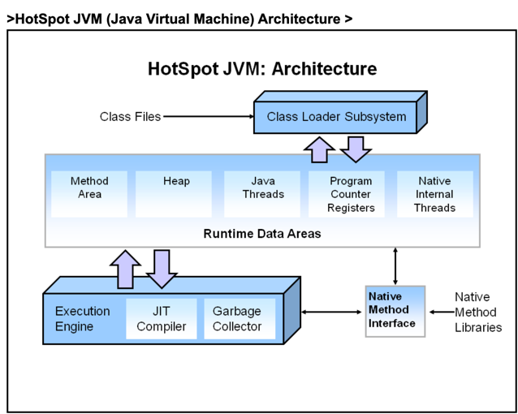

# core-java-17-maven
This is test Project
### Linear Search Algorithm
- linear search or sequential search is a method for finding a target value within a list. It sequentially checks each element of the list for the target value until a match is found or until all the elements have been searched.
### Binary Search Algorithm
- Binary search is a fast search algorithm with run-time complexity of Ο(log n). This search algorithm works on the principle of divide and conquer. For this algorithm to work properly, the data collection should be in the sorted form.
- There are many ways we can write logic for binary search:
  - Iterative implementation
  - Recursive Implementation
  - Using Arrays.binarySearch()
  - Using Collections.binarySearch()
### Interpolation search
  - Interpolation search is an algorithm for searching for a given key in an indexed array that has been ordered by numerical values assigned to the keys (key values). It parallels how humans search through a telephone book for a particular name, the key value by which the book's entries are ordered.
### JVM Architecture
  
- Runtime Data Areas of JVM >
  - 2.1) Method Area > Method area stores data for each and every class like fields,constant pool,method’s data and information
  - 2.2) Heap > Heap is place where all objects are stored in JVM
  - 2.3) Java Threads (Java thread Stacks) >Whenever new method is called new stack frame is created and it is pushed on top of that thread's stack
  - 2.4) Program counter registers (PC Registers) > the address of instructions currently and next address being executed.
  - 2.5) Native internal Threads (Native thread stack ) >Native internal threads area contains all the informations related to native platform.
###### https://www.javamadesoeasy.com/2017/03/top-30-jvmjava-virtual-machine.html d
- Execution Engine of JVM >
  - 3.1) JIT(Just In Time) compiler > JIT compiler compiles bytecodes to machine code at run time and improves the performance of Java applications.
  - 3.2) Garbage Collector - Garbage Collector Garbage collection is the process by which JVM clears objects (unused objects) from heap to reclaim heap space.
  - 3.3) Native method libraries of JVM > Native method interface is an interface that connects JVM with the native method libraries for executing native methods.
###### JIT Compiler internal working >
  - JIT compilation does require processor time and memory usage. When the JVM first starts up, lots of methods are called. Compiling all of these methods might can affect startup time significantly, though program ultimately may achieve good performance.
    Methods are not compiled when they are called first time. For each and every method JVM maintains a call count, which is incremented every time the method is called. The methods are interpreted by JVM until call count not exceeds JIT compilation threshold (The JIT compilation threshold improves performance and helps the JVM to start quickly. The threshold has been selected carefully by java developers to obtain an optimal performances. Balance between startup times and long term performance is maintained).
    Therefore, very frequently used methods are compiled as soon as JVM has started, and less used methods are compiled later. 
  - After a method is compiled, its call count is reset to zero and subsequent calls to the method increment it call count. When the call count of a method reaches a JIT recompilation threshold, the JIT compiler compiles method second time, applying more optimizations as compared to optimizations applied in previous compilation. This process is repeated until the maximum optimization level is reached. Most frequently used methods are always optimized to maximize the performance benefits of using the JIT compiler.
### PARAMETERS you have used for Permanent Generation?
  ```text
-XX:PermSize: It’s is initial value of Permanent Space which is allocated at startup of JVM.
 - Example of using -XX:PermSize VM (JVM) option in java >
 - java -XX:PermSize=512m MyJavaProgram
 - It will set initial value of Permanent Space as 512 megabytes to JVM


-XX:MaxPermSize: It’s maximum value of Permanent Space that JVM can allot up to.
  - Example of using -XX:MaxPermSize VM (JVM) option in java >
  - java -XX:MaxPermSize=512m MyJavaProgram
  - It will set maximum value of Permanent Space as 512 megabytes to JVM
```
### PARAMETERS you have used in JVM Heap memory?
 ```text
  -Xms : Xms is minimum heap size which is allocated at initialization of JVM. 
Examples of using -Xms VM (JVM) option in java >
java -Xms512m MyJavaProgram
It will set the minimum heap size of JVM to 512 megabytes.


-Xmx : Xmx is the maximum heap size that JVM can use. 
Example of using -Xmx VM option in java >
java -Xmx512m MyJavaProgram 
It will set the maximum heap size of JVM to 512 megabytes.
For more explanation -Xms and -Xmx JVM parameters and differences


-XX:NewRatio : NewRatio controls the size of young generation. 
Example of using -XX:NewRatio  VM option in java > 
-XX:NewRatio=3 means that the ratio between the young and old/tenured generation is 1:3. 


-XX:NewSize - NewSize is minimum size of young generation which is allocated at initialization of JVM. 


-XX:MaxNewSize - MaxNewSize is the maximum size of young generation that JVM can use. 


-XX:SurvivorRatio :   (for survivor space) 
SurvivorRatio can be used to tune the size of the survivor spaces, but this is often not as important for performance. 


-XX:PermSize: It’s is initial value of Permanent Space which is allocated at startup of JVM.
-XX:MaxPermSize: It’s maximum value of Permanent Space that JVM can allot up to.
For explanation and example - What are -XX:PermSize and -XX:MaxPermSize with Differences

Question 13. Mention some of the most important VM (JVM) PARAMETERS you have used for Young Generation in JVM Heap memory?
Answer.  It is important garbage collection interview question for experienced developers to specifically identify and answer jvm parameters for young generation.


-Xmn : -Xmn sets the size of young generation. 
Example of using -Xmn VM (JVM) option in java >
java -Xmn512m MyJavaProgram 
For more explanation and example - Read :  -Xmn JVM parameters


-XX:NewRatio : NewRatio controls the size of young generation. 
Example of using -XX:NewRatio  VM option in java > 
-XX:NewRatio=3 means that the ratio between the young and old/tenured generation is 1:3. 


-XX:NewSize - NewSize is minimum size of young generation which is allocated at initialization of JVM. 


-XX:MaxNewSize - MaxNewSize is the maximum size of young generation that JVM can use. 


-XX:SurvivorRatio :   (for survivor space) 
SurvivorRatio can be used to tune the size of the survivor spaces, but this is often not as important for performance. 
Example of using -XX:SurvivorRatio > -XX:SurvivorRatio=6 sets the ratio between each survivor space and eden to be 1:6.

``` 
#### Sorting Reference
 ```text
//Sorting a List
Collections.sort(numbersList);
Collections.sort(numbersList, Collections.reverseOrder());
 
//Sorting a Set
Set to List -> Sort -> List to Set
Collections.sort(numbersList);
 
//Sorting a Map
TreeMap<Integer, String> treeMap = new TreeMap<>(map);
 
unsortedeMap.entrySet()
    .stream()
    .sorted(Map.Entry.comparingByValue())
    .forEachOrdered(x -> sortedMap.put(x.getKey(), x.getValue()));
 
//Java 8 Lambda
Comparator<Employee> nameSorter = (a, b) -> a.getName().compareToIgnoreCase(b.getName());
Collections.sort(list, nameSorter);
 
Collections.sort(list, Comparator.comparing(Employee::getName));
 
//Group By Sorting
Collections.sort(list, Comparator
                        .comparing(Employee::getName)
                        .thenComparing(Employee::getDob));
 ``` 
